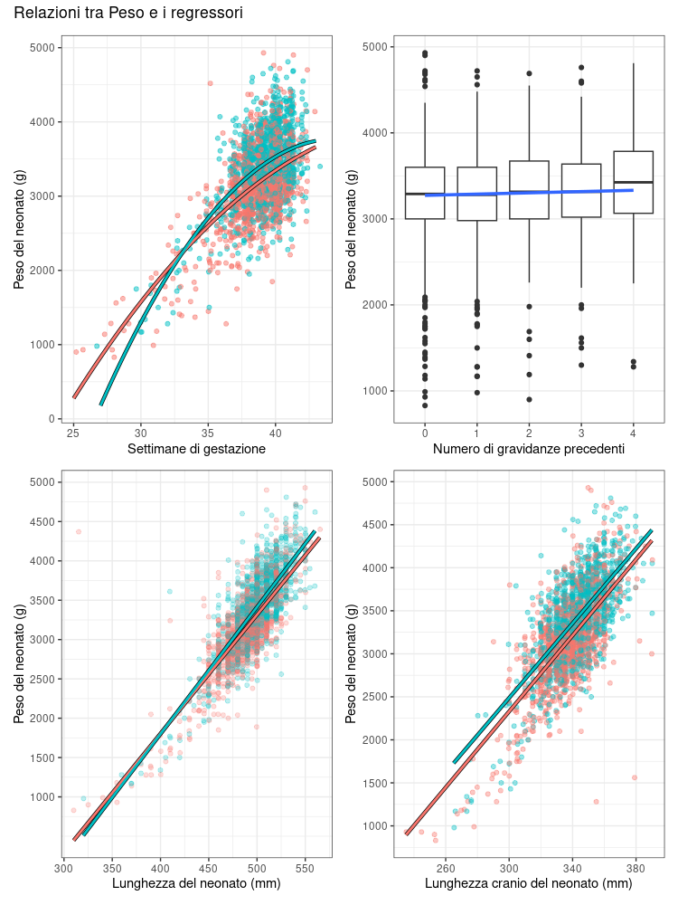

# previsione-peso-neonati
Modello statistico per prevedere il peso dei neonati in R

## Contenuto della repo
* `neonati.csv`: il dataset
* `previsione_peso_neonati.r`: il file sorgente R
* `report_statistica_inferenziale.pdf`: svolgimento della consegna del progetto

# Descrizione del progetto
Si vuole scoprire se è possibile prevedere il peso del neonato alla nascita date tutte le altre variabili.  
In particolare, si vuole studiare una relazione con le variabili della madre per capire se queste hanno
o meno un effetto significativo sul neonato (ad esempio, l’effetto potenzialmente dannoso del fumo
potrebbe portare a nascite premature).  

Il progetto ha previsto:
* Analisi descrittiva
* Saggiare certe ipotesi date con dei test T e test chi-quadrato
* Analisi multidimensionale
* Ricerca del modello di regressione lineare multipla migliore (sia tramite procedura stepwise automatica sia tramite ricerca manuale)
* Analisi numerica e grafica dei residui
* Effettuare previsioni con il modello
* Riportare grafici con `ggplot2` relativi al modello.

